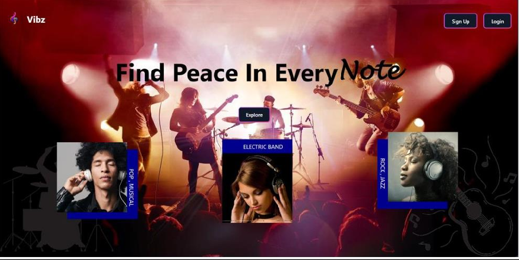
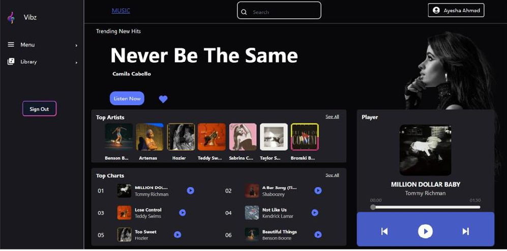
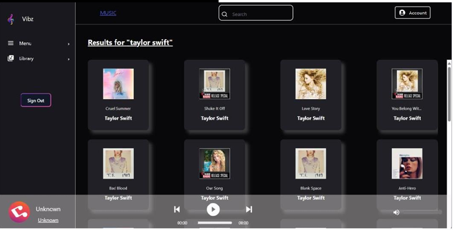
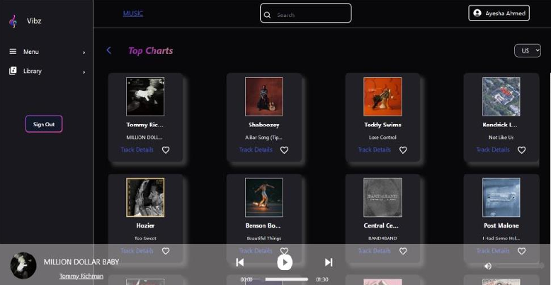

<h1>Vibz Music Player</h1>

Welcome to Vibz, a modern music player built with React.js, Node.js, Express, and Microsoft Azure. This project integrates AI-powered song recommendations using content filtering, offering a personalized music experience.

<h2>Features</h2>

Vibz comes with a wide range of features to enhance your music listening experience:

<ul>
  <li>**Search Songs**: Find your favorite songs quickly and easily.</li>
  <li>**Top Charts**: Stay updated with the latest top charts.</li>
  <li>**Top Artists**: Discover the most popular artists.</li>
  <li>**Around You**: Explore music trending around your location.</li>
  <li>**Favorites**: Save your favorite songs and artists for easy access.</li>
  <li>**Accounts**: Manage your personal account and preferences.</li>
  <li>**AI-Powered Recommendations**: Enjoy personalized song recommendations using content filtering.</li>
  <li>**Responsive Design**: Experience seamless music enjoyment on any device, with a user-friendly interface optimized for both desktop and mobile platforms.</li>
</ul>
<h3>Interfaces</h3>

